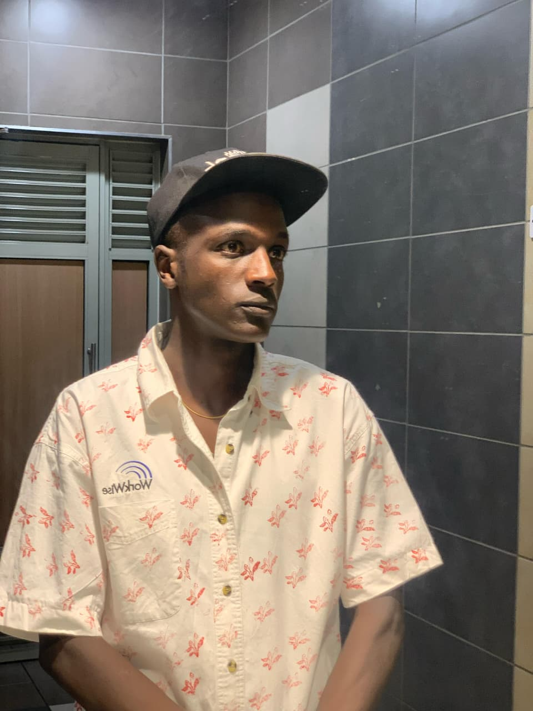

# 🖼️ How to Update Your Profile Image

## Current Profile Image
- **Location**: `images/eluis.jpg`
- **Used in**: Hero section of index.html
- **Current code**: ``

## 📋 Step-by-Step Guide

### Method 1: Replace Existing Image (Easiest)

1. **Prepare your new image**:
   - Recommended size: 400x400 pixels (square)
   - Format: JPG, PNG, or WebP
   - File size: Under 200KB (use Image Optimizer if needed)

2. **Optimize your image** (Optional but recommended):
   - Go to: http://localhost:8000/image-optimizer.html
   - Upload your image
   - Set quality to 80-90%
   - Set max width/height to 400px
   - Download optimized image

3. **Replace the file**:
   - Rename your new image to: `eluis.jpg`
   - Navigate to the `images/` folder
   - Delete or backup the old `eluis.jpg`
   - Copy your new `eluis.jpg` into the `images/` folder

4. **Test**:
   - Go to: http://localhost:8000
   - Refresh the page (Ctrl+F5 to clear cache)
   - Your new image should appear

### Method 2: Use a Different Filename

1. **Add your new image**:
   - Save your image with a descriptive name (e.g., `profile-2026.jpg`)
   - Copy it to the `images/` folder

2. **Update the HTML**:
   - Open `index.html` in your code editor
   - Find this line (around line 80):
     ```html
     
     ```
   - Change `eluis.jpg` to your new filename:
     ```html
     
     ```

3. **Update the configuration file** (Optional):
   - Open `portfolio-config.js`
   - Find the `profileImage` line:
     ```javascript
     profileImage: "images/eluis.jpg",
     ```
   - Update to:
     ```javascript
     profileImage: "images/profile-2026.jpg",
     ```

4. **Save and test**:
   - Save all files
   - Refresh your browser (Ctrl+F5)

## 🎨 Image Recommendations

### Profile Photo Guidelines

| Aspect | Recommendation |
|--------|---------------|
| **Size** | 400x400px (1:1 ratio) |
| **Format** | JPG (best for photos) or WebP |
| **Quality** | 80-90% |
| **File Size** | Under 200KB |
| **Background** | Clean, professional |
| **Lighting** | Well-lit, clear face |
| **Expression** | Professional, friendly |

### Image Optimization Tips

1. **Use the Image Optimizer**:
   ```
   http://localhost:8000/image-optimizer.html
   ```

2. **Online Tools** (if needed):
   - TinyPNG: https://tinypng.com/
   - Squoosh: https://squoosh.app/
   - Compressor.io: https://compressor.io/

3. **Recommended Settings**:
   - Width: 400px
   - Height: 400px
   - Quality: 85%
   - Format: JPEG

## 🚀 Quick Update Commands

### Using File Explorer (Windows)
```
1. Navigate to: C:\Users\USER\OneDrive\Desktop\PROJECTS\portfolio\images\
2. Replace eluis.jpg with your new image
3. Refresh browser (Ctrl+F5)
```

### Using Command Line
```bash
# Navigate to images folder
cd images

# Copy your new image (replace path with your image location)
copy "C:\path\to\your\new-image.jpg" eluis.jpg

# Or rename if you want to keep both
copy "C:\path\to\your\new-image.jpg" profile-new.jpg
```

## ✅ Testing Checklist

After updating your image:

- [ ] Image appears in hero section
- [ ] Image loads quickly (under 2 seconds)
- [ ] Image is clear and not pixelated
- [ ] Image is properly centered
- [ ] Image looks good on mobile devices
- [ ] Browser cache cleared (Ctrl+F5)

## 🔧 Troubleshooting

### Image Not Showing
1. **Check file path**: Ensure image is in `images/` folder
2. **Check filename**: Must match exactly (case-sensitive)
3. **Clear cache**: Press Ctrl+F5 in browser
4. **Check file format**: Use JPG, PNG, or WebP

### Image Too Large
1. Use the Image Optimizer tool
2. Reduce quality to 80-85%
3. Resize to 400x400px
4. Convert to JPG format

### Image Looks Blurry
1. Use higher quality original image
2. Increase quality setting to 90%
3. Ensure original is at least 400x400px
4. Don't upscale small images

### Image Not Centered
1. Ensure image is square (1:1 ratio)
2. Check CSS in `css/styles.css`
3. Clear browser cache

## 📱 Mobile Optimization

Your profile image will automatically be responsive. Test on:
- Desktop (1920x1080)
- Tablet (768x1024)
- Mobile (375x667)

## 🎯 Current Image Location

```
portfolio/
└── images/
    └── eluis.jpg  ← Your profile image is here
```

## 💡 Pro Tips

1. **Keep a backup**: Save your original image before replacing
2. **Use descriptive names**: `profile-2026.jpg` instead of `IMG_1234.jpg`
3. **Optimize first**: Always optimize images before uploading
4. **Test on mobile**: Check how it looks on different devices
5. **Professional photo**: Use a high-quality, professional headshot

## 🔗 Quick Links

- **Image Optimizer**: http://localhost:8000/image-optimizer.html
- **Portfolio**: http://localhost:8000
- **Images Folder**: `images/`

---

**Need help?** Check the troubleshooting section above or use the Image Optimizer tool to prepare your image!